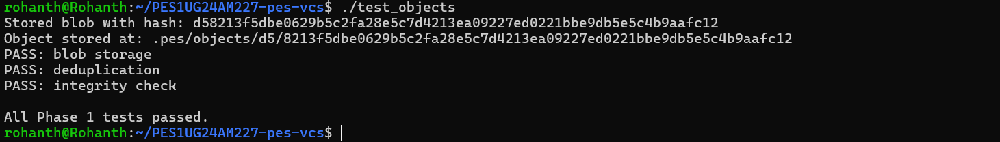
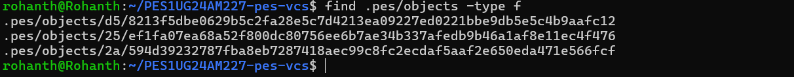
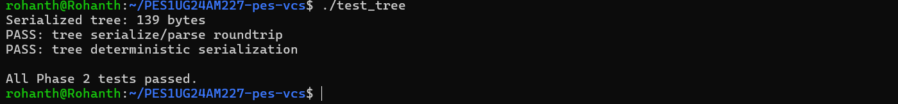
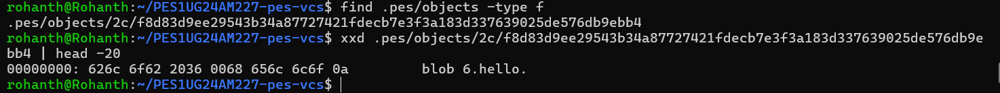
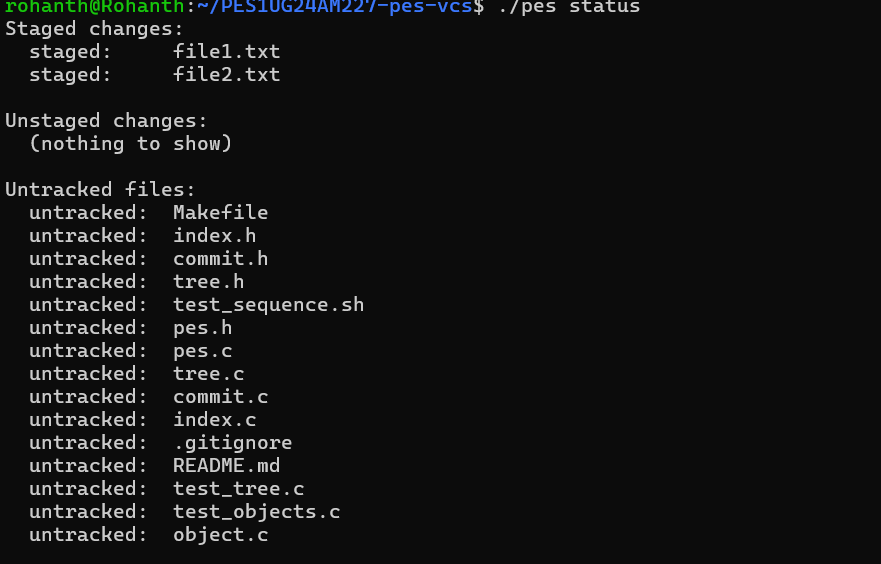
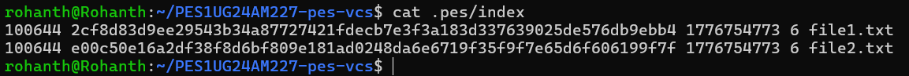
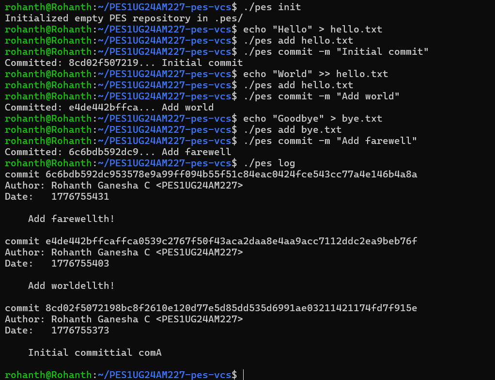
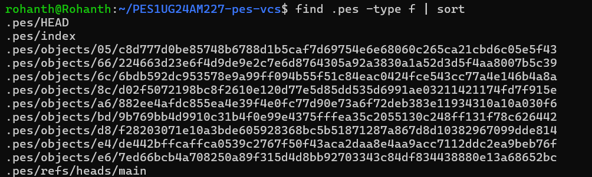
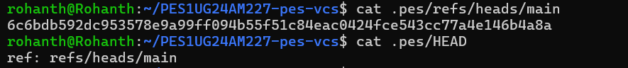
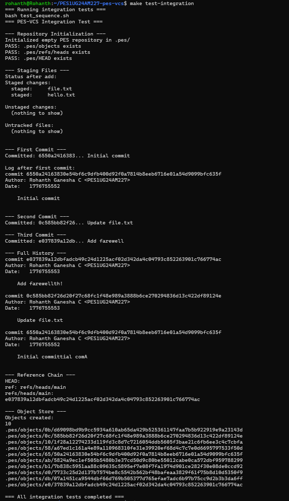

## Overview

PES-VCS is a local version control system built from scratch in C, modeled after Git's internal design. It implements content-addressable object storage, a staging area, tree-based directory snapshots, and a commit history with parent pointers — all stored in a .pes/ directory.

The project was built on Ubuntu 22.04 (WSL) and covers core operating system concepts including filesystem operations, atomic writes, SHA-256 hashing, directory sharding, and linked data structures on disk.

## Results & Outputs

### 🔹 Phase 1: Object Storage

**1A — Test Objects Output**

  

**1B — Object Store Directory Structure**

  

### 🔹 Phase 2: Tree Objects

**2A — Tree Test Output**

  

**2B — Raw Tree Object (Hex Dump)**

  

### 🔹 Phase 3: Index (Staging Area)

**3A — Init → Add → Status Workflow**

  

**3B — Index File Contents**

  

### 🔹 Phase 4: Commits & History

**4A — Commit Log Output**

  

**4B — Object Store Growth**

  

**4C — HEAD and Branch References**

  

**test-integration (All Integration Tests Completed)**

  

Certainly! Here’s a version of your text, reformatted and clarified for direct inclusion in a README.md file. Headings, bullet points, and code formatting are used for readability and Markdown compatibility.

---

## Phase 5

### Q5.1 — How would you implement `pes checkout <branch>`?

To implement `pes checkout`, two main actions are required:

1. **Update the `.pes/` directory:**
   - Update `.pes/HEAD` to contain `ref: refs/heads/branchname`.
   - If the branch is new, create `.pes/refs/heads/branchname` containing the current commit hash.

2. **Restore the working directory:**
   - Read the target branch’s commit object to get its tree hash.
   - Recursively walk the tree and write every blob to disk at its correct path.
   - Delete files that existed in the old branch but are absent from the new branch.

**Complexities to handle:**
- **Dirty working directory:** Detect and refuse checkout if unsaved modifications would be overwritten.
- **Recursive tree traversal:** Correctly create and populate nested subdirectories.
- **Deletions:** Remove files present in the old tree but absent in the new one.
- **Atomicity:** Minimize the window where the working directory could be left in a broken state if checkout fails partway.

---

### Q5.2 — How would you detect a dirty working directory conflict using only the index and object store?

For each file tracked in the current index:

1. **Check for modifications:**
   - Stat the file on disk to get its current mtime and size.
   - Compare these with the mtime and size stored in the index entry.
   - If either differs, the file has been modified since last staged.

2. **Check for branch differences:**
   - Read the target branch’s commit object and get its tree.
   - Find the blob hash for the same file path and compare it with the hash in the current index entry.

**Conflict detection:**
- If the file is both modified on disk and different between the two branches, checkout must refuse with an error (e.g., “your local changes would be overwritten by checkout”).
- If the file differs between branches but matches the index (i.e., working copy is clean), checkout can safely overwrite it.

---

### Q5.3 — What happens if you make commits in detached HEAD state, and how do you recover?

- **Detached HEAD:** `.pes/HEAD` contains a raw commit hash instead of a branch reference.
- **Making commits:** Commits are created and linked as normal, but no branch ref is updated to track them. Once you checkout a different branch, those commits become unreachable and may be deleted by garbage collection.
- **Recovery:**
  - If you haven’t switched away, create a new branch at the current position by writing the current HEAD hash into a new file under `.pes/refs/heads/`.
  - If you’ve already switched away, you need to know the lost commit hash. Without a reflog, recovery requires remembering the hash or finding it in terminal history. Once known, create a new branch file pointing to it to make the chain reachable again.

---

## Phase 6

### Q6.1 — Describe an algorithm to find and delete unreachable objects. What data structure would you use, and how many objects would you visit for 100,000 commits across 50 branches?

**Algorithm: Mark-and-sweep**

1. **Mark phase:**
   - Start from all branch refs in `.pes/refs/heads/` and HEAD.
   - Add each commit hash to a reachable set.
   - For each commit, extract its tree hash and add it.
   - Recursively walk the tree, adding all sub-tree and blob hashes.
   - Follow parent pointers until reaching a commit with no parent.

2. **Sweep phase:**
   - Traverse every file under `.pes/objects/`.
   - Reconstruct the hash from the path.
   - If the hash is not in the reachable set, delete the file.

**Data structure:**  
A hash table keyed on the 32-byte ObjectID (O(1) insertion and lookup) is best. A sorted array with binary search (O(log n) lookup) is a simpler alternative.

**Estimate:**  
With 100,000 commits and ~25 objects per commit, about 2.5 million objects are visited in the mark phase. The sweep phase reads the entire `.pes/objects/` directory, which could be similarly large. Total cost: roughly 2–5 million file operations for a repository of that size.

---

### Q6.2 — Why is it dangerous to run GC concurrently with a commit? Describe the race condition and how Git avoids it.

**The danger:**  
During commit creation, new objects may exist in the store but are not yet referenced by any branch or tag. If GC runs concurrently, it may delete these objects as unreachable before the commit operation finishes, leading to repository corruption.

**Race condition:**
- Commit operation writes blobs to the object store.
- GC starts, scans refs, and does not see the new blobs.
- GC deletes the blobs as unreachable.
- Commit operation resumes and writes tree/commit objects referencing the now-deleted blobs.

**How Git avoids this:**
- Implements a grace period: loose objects newer than a threshold (default two weeks) are never deleted by GC, ensuring in-progress operations can complete.
- Uses a lock file (`.git/gc.pid`) to prevent multiple GC processes from running simultaneously.
- Performs GC on loose objects only after they have existed long enough that no concurrent operation could be referencing them.
